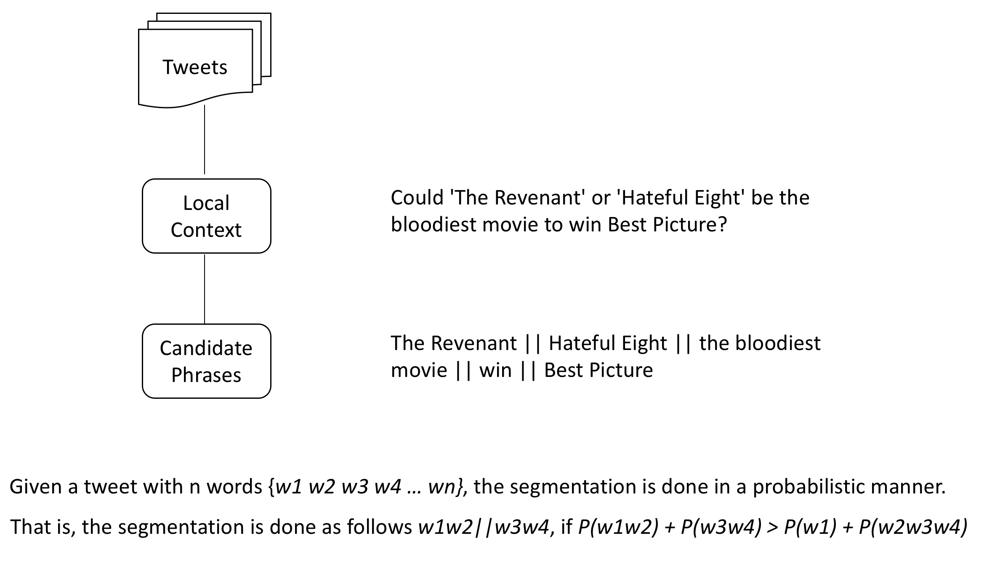
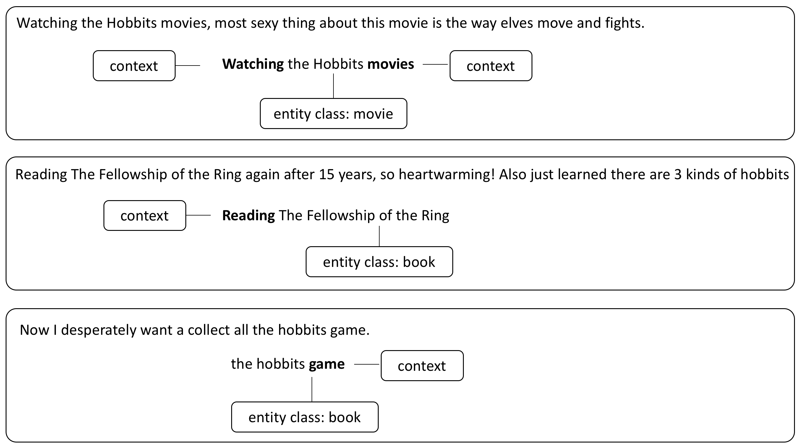
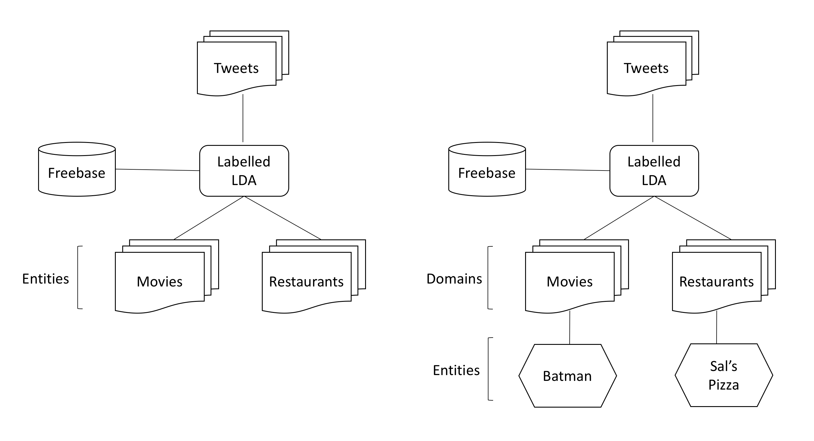
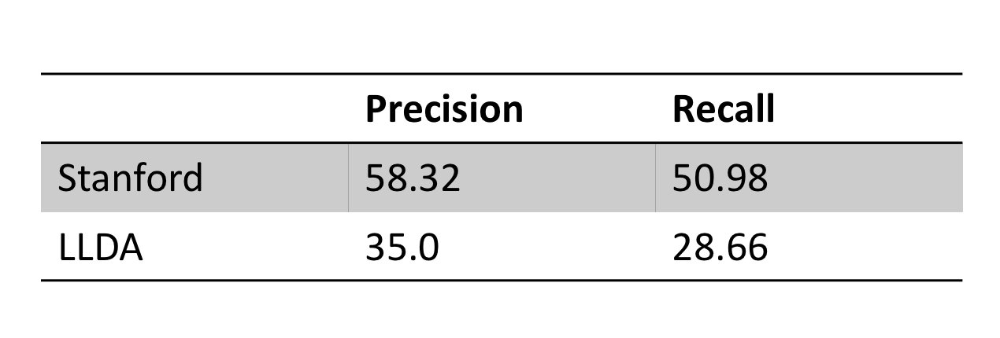
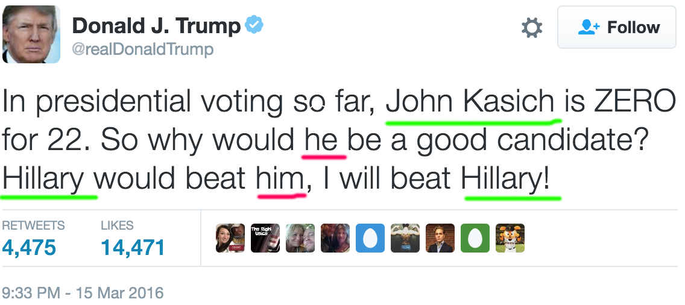

### Named Entity Recognition and Classification [NERC]

<hr/>
<span style="color:maroon">Praveen Kumar Srinivasan | Prof. Gillian Dobbie</span>


Notes:

---

### Named Entity Recognition and Classification
<hr/>

> NERC seeks to locate and classify elements in text into pre-defined categories such as the names of persons, organizations, locations etc.


'''
<span style="font-size:70%">[Jim]<sub><i><span style="color:maroon">Person</span></i></sub> bought 300 shares of [Microsoft]<sub><i><span style="color:maroon">Organization</span></i></sub> in [2006]<sub><i><span style="color:maroon">Time</span></i></sub>.</span>
'''

Notes:
- Read the definition
- Explain the example

---

### Traditional NERC Systems
<hr/>

- Use **structure or grammar** to extract Named Entities
- Early systems relied on heuristics, while the modern system resort to machine learning
- **Supervised Learning** rely on large training data
- **Unsupervised learning** techniques rely on lexical resources, contextual statistics
- Challenges: training data, handling previously unseen entities
- Rule based systems are preferred when there are not enough training data

Notes:
- They have been in place since early 90s.
- They primary use the grammar and structure of the language to identify the Entities.
- Early systems relied on heuristics, while the modern system resort to machine learning
- Supervised learning system rely on large amounts of training data to identify entities

-----

### Different NERC Approaches
<hr/>

- Supervised Learning System
    + Tagged Training Data
- Lexical Resources
    + WordNet, Wikipedia, WikiData
- Grammar or Rules
    + Contains (Mr.), ContainsAlpha(U.S)
- Lexical Patterns
    + Collocation, Prefix, Postfix
- White-List or Dictionaries
    + Celebrities, City, Movies

Notes:
- People have used different approaches to solve the problem
- Supervised learning systems use a large set of tagged training data to build a model to identify named entities
- Unsupervised learning systems use lexical resources such as wordnet and wikipedia
- Certain approaches use the grammar of identify the entities
- and certain approaches employ rules to identify entities
- for ex:
- Some systems use lexical patterns like word collocations, word positions, word prefix to identify entities
- Certain systems use whitelist to identify entities.
- they work primarily well to identify entities within a specific domain for ex movies, tv shows

---

### Features used in NERC Systems
<hr/>

- **Boolean Attribute** (isWordCapital)
- **Numeric Attribute** (lenOfWord)
- **Word Level Attributes** (case, punctuation, word endings, part-of-speech)
- **Document/Corpus Level Attributes** (word frequency, inverse document frequency, co-occurrences, position in the text)
- **Lookup Attributes** (StopWords, white-list dictionaries, abbreviations, prefix, postfix, location)

Notes:
- Now lets see some of the features which nerc systems use
- certain nerc system use boolean Attributes such as is the word capital or numeric attributes such as the len of the word
- certain systems use word level attributes such as the case of the word, part of speech of the word, the word endings
- then there are systems that use document or corpus level attributes such as word freq, idf, word co-occurrences, i.e wich word co-occur commonly to build nerc models
- certain systems use a pre-defined list for attributes for lookup such as stopwords, abbreviations, common prefix and postfix

---

### Shortcoming of Traditional NERC Systems
<hr/>

- Dependency on well-formed language structure
- Need for large training data
- Need for updated lexical resources
- Handling previously unseen patterns

Notes:
- traditional nerc systems have some shortcomings
- they strongly depend on the language structure
- they need large volumes of tagged training data
- they need up to date lexical resources
- Cannot handle previously unseen entities well

---

### NERC on Twitter Data
<hr/>

Notes:
- the objective of my research problem is to build a nerc system that works on twitter data

---

### Twitter Data Characteristics
<hr/>

- **Length**: Maximum Length of a tweet is 140 characters.
- **Language**: They are hand typed, have misspellings, slang, emojis, abbreviations.
- **Open Domain**: The tweets can be on any topic.
- **Volume & Velocity**: The magnitude and speed of the data is vast.

Notes:
- due to the following characteristics, building a nerc systems on twitter data is quite challenging
- the maximum character length of tweet is 140 chars, due to which it is prone to abbrevations and emojis
- since it is hand typed and it is also prone to spelling mistakes
- and as twitter is a open platform for everyone, the tweets can be on any topic.
- today, twitter data is bigger than the entire collection of library of congress

-----

### Characteristics of Social Media Data
<hr/>

- Slang
- Abbreviations
- Emojis
- HashTags
- Character Repetition
- Improper Case

---

### Twitter Data Features
<hr/>

- Social Circle & Extended Social Circle
- Popularity of the tweet and tweeter
- Presence of Trending HashTags
- Temporal Features

Notes:
- Twitter data has some features which can be used to model a nerc system
- in my research i will be using some the following features to build a nerc system
- the social circle and the extended social circle of a person
- temporal features such as location and time

---

### Objectives: Research Problem
<hr/>

- Unsupervised Learning/Semi-Supervised Learning
- Classify entities across open-domain
- Assign Probabilities to Entity's that belong to multiple classes
- Address shortcoming of traditional NERC systems
- Handle cases where:
    + lexical resources fail
    + not enough training data
    + rules would be hard to frame

Notes:
- now that we have seen the shortcomings og traditional nerc systems and the challenges of working with twitter data
- The key objectives for my research are the following
- build a Unsupervised or a semi-supervised system as they do not require much training data
- classify entities across domains, not just person, location, organization. I would like to classify a vast list of entities such as movies, products, restaurants
- when we come across entities that belong to multiple classes for ex: harry can be movie, book or game.
- we need to assign probabilities to class labels for ex:
- next address the short coming of traditional nerc systems

---

### Methodology
<hr/>

- Latent Dirichlet Allocation (LDA)
- Labelled LDA
- Global and Local Context
- Context based Weakly Supervised LDA

Notes:
- Now I will take you through some of the concepts that would form the basis of my research
- i will also explain why i use these concepts as we go along

---


### Latent Dirichlet Allocation (LDA)
<hr/>

> Blei, David M.; Ng, Andrew Y.; and Jordan, Michael I. (2003) "Latent Dirichlet Allocation." Journal of Machine Learning Research. 3, 993-1022

- Probabilistic Generative Model
- Used in Topic Modelling

---

### LDA - Intuition
<hr/>

- Documents are a sequence of terms
- Topics are the relationship between terms
- Document is a distribution over Topics
- Topic is a distribution over terms

Notes:
- the objective of topic modelling is to uncover the topics in a given document collection
- the key intution behind lda is: that the document a sequence of terms and topic are the relationship between these terms
- in other words

---

### Generative Model
<hr/>


<small>Source: LDA - David Blei, Andrew Ng, Michael Jordan</small>

- To create a new document:
    - <span style="font-size:80%">Select a **distribution of topics**</span>
    - <span style="font-size:80%">Randomly pick a **topic** from this distribution</span>
    - <span style="font-size:80%">Draw a **word** from that topic</span>

Notes:
- LDA is a probabilistic generative algorithm
- Generative algorithms:  tries to models how the data is generated in order to categories the data
- in case of topic modelling, lda tries to see how a document is generated from distribution of topic in order to categories the documents into topics
- to create a document

---

### Posterior Inferencing
<hr/>


- In reality, we have documents and want to **infer the topics** from which these documents were generated.
- Hence, we use statistical techniques to **invert** this process.

Notes:
- as we have seen that in the case of generative model we use the topic distribution to generate docs
- it can be seen in the first part of the image here, that we have topics and words for each of the two topics,
    which we can use to generate docs 1,2,3.
- In reality, we have documents and want to **infer the topics** from which these documents were generated.
- Hence, we use statistical techniques like LDA to **invert** this process.

---

### Labelled LDA
<hr/>


- Constrains LDA by defining a one-to-one correspondence between LDA’s latent topics(or words in each topic) and entity type from WikiData

Notes:
- at a high level, lda can be seen as clustering algorithm for docuuments
- llda is for classification
- it does so by defining a one to one correspondence btw the topic extracted from lda and a entity type from wiki
- they are probabilistic approaches. the way work is as follows
- we set the number of topics  we would want as in the case of clustering
- initially the words are assigned to all the topics with equal probability
- then these probabilities are used as prior knowledge. So in the next iteration the next words are assigned to a topic based the words it already contains

---

### Global and Local Context
<hr/>

Notes:
- the next methodology which i am going to talk abt is the Global and Local Context approach

---

### Global and Local Context
<hr/>

- Targeted streams have a gregarious property
- Uses WikiData (Global); Stop words and Sentence Delimiters (Local) to segment tweets
- Each segment is a potential candidate entity
- Detects emerging trends
- Uses a Probabilistic Approach

Notes:
- we can identify entities that are globally know to us through the use of knowledge bases such as wikidata and wikipedia
- however due the real time nature of twitter data, it often contains new emerging entities that not updated in the lexical resources such as wikipedia
- to handle such emerging entities, we take advantage of the gregarious property of twitter data
- target streams such as search results for a query, tweet that use the same hashtags, talk about specific topics
- therefore if we consider the recent tweets, the emerging entities can be captured
- we can use the last n tweets say 1000 tweets and try to see if new emerging entity has repeated in the local context
- if many people are talking a emerging entity then it is bound to repeat in the local context

---

### Local Context
<hr/>



Notes:
- now lets see how is done
- take last n tweets and segment these tweets into meaning full phrases
- the tweets are segmented by splitting the tweets at stopwords, sentence Delimiters such as , . ?
- then we try to segment the remaining rest of the phrases based on the probability of co-occurrence
- for example consider this tweet
- so once the segmentation is done we will get certain candidate phrase that could be either entities or contextual words around these entities
- next we have to identify which of these phrases are entities and classify them into the corresponding entity class

---

### Weakly Supervised LDA
<hr/>

Notes:
- Now let see a methodology that we can use to classify these candidate phrases

---

### Weakly Supervised LDA
<hr/>



Notes:
- words that appear around the entities give great details about the entities and there entity type
- for example

---

### Weakly Supervised LDA
<hr/>


Notes:
- in order to classify the candidate phrases we try to build a repository of context and entity types
- this done as follows

---

### Why Probabilistic Approach?
<hr/>

- No need for **word order or language** structure
- Handles **co-occurrence**
- New and unseen entities can be identified
- Estimates get better as we observe more data


---

### My Approach
<hr/>


Notes:
- Now i will briefly explain the overview of my approach
- User want to search for something and issues a query to the system, the system will search for tweets in his social circle, then
- Once the tweets are gathered, they are clustered though lda
- These clusters are classified into a predefined classes chosen from WikiData using Labelled LDA
- For this classification we download the list of entities and their classes from WikiData
- We apply Probabilistic NERC with in each of the domain that is identified through Labelled LDA

-----

### Global Context
<hr/>



-----

###  Local Context
<hr/>


---

### Base line comparison
<hr/>

- Stanford NER has been implemented for base line comparison.
- Trained on Reuters Dataset

```
- As much as I believe DC movies are trash, that Batman vs Superman
  movie should break all records w/ ease or jokes flying.
    - ["{'PERSON': ['Batman'], 'LOCATION': ['DC']}"]
```

```
- Why is every add on YouTube or Spotify for a horror movie????
  I hate scary movies 😭😭😭
    - ["{'ORGANIZATION': ['YouTube']}"]
```

---

### What has been done so far?
<hr/>

- Implemented Labelled LDA to extract entities on Tweets
- Trained with WikiData Data

```
- As much as I believe DC movies are trash, that Batman vs Superman
  movie should break all records w/ ease or jokes flying.
    - ["{'person': ['Batman'], 'company': ['DC']}"]
```

```
- Why is every add on YouTube or Spotify for a horror movie????
  I hate scary movies 😭😭😭
    - ["{'company': ['YouTube'], 'product': ['Spotify']}"]
```

---

### Evaluation
<hr/>

```
- COR = Number of correct guesses by the System
- ACT = Number of actual guesses by the System
- POS = Number of entities in the Dataset

- Precision = COR / ACT
- Recall    = COR / POS
```

---

### Results
<hr/>



---

### Future Work
<hr/>

- Improve the Performance of the Labelled LDA Algorithm
- Implement the Local Context - Candidate Phrases Extraction Algorithm
- Use Hashtags to determine the Context
- Implement the Context based WS-LDA Algorithm
- Build an Ensemble system that merges the results of the above mentioned algorithm

-----

### Future Work
<hr/>

- **Coherence Resolution** is the task of finding all expressions that refer to the same entity in a discourse. Example:


Notes:
    ```
    + On hearing the discovery of George Mallory's body,
      he told reporters he still thinks he was first.
    ```

---

### Thats all! (For Now!)
<hr/>

Thanks and Feedbacks

